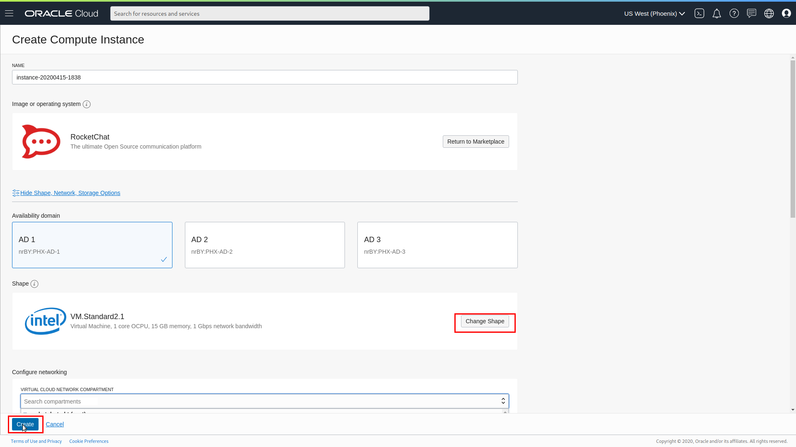
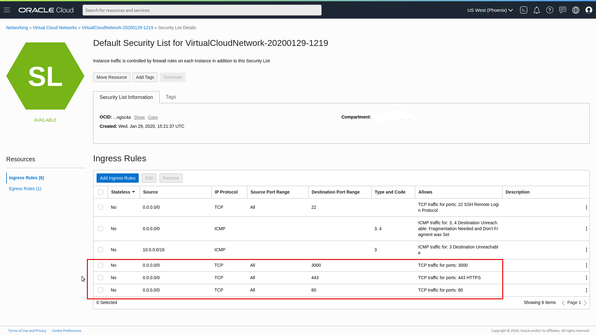

# Deploying Rocket.Chat on Oracle Cloud Infrastructure

You can install Rocket.Chat on Oracle infrastructure using the Rocket.Chat application from the Oracle Cloud Marketplace, it is a very easy install. Find our listing in Oracle's marketplace [here](https://cloudmarketplace.oracle.com/marketplace/en_US/listing/72006881).

The Rocket.Chat App installs a Linux image with everything needed for the Rocket.Chat server to run, repositories, directories and permissions, systemd files, needed libraries, node, mongo database server and traefik to be used as the webserver optionally.

To be able to install the image from the marketplace you will need to login to your Oracle Cloud Infrastructure account, after that go the main Menu and select Marketplace and Applications:

<p style="display: flex" float="left">
  
  
</p>

Select the Rocket.Chat application, you will see lots of information about the image including usage instructions to follow once the instance is already running, choose a compartiment for the installation and launch your instance:

<p style="display: flex" float="left">
  
  
</p>

This application will run in a compute instance, you can change the shape of it to fit your usage needs, find more information of our minimum resource recommendations [here](https://rocket.chat/docs/installation/minimum-requirements/#minimum-requirements-for-server-deployment).



Wait for the provisioning stage to be finished and you will find information about your instance you will need later, like the public IP and the subnet where it's running, the image running in your instance allows traffic to Rocket.Chat required ports using iptables rules, but you need to edit the security group associted to the subnet where the instance is running for the traffic to actually go through:

<p style="display: flex" float="left">
  
  
  
</p>

Finally add the following ports to the security group 3000, 443 and optionally 80 (you can edit this later and adapt it to your architecture designs):



And that should be all you need to do in the Oracle account, now move to the new instance running, you’ll likely want a registered domain name to access Rocket.Chat and secure the access.

## Configuring your Rocket.Chat server: Setting up HTTPS, Backups and Upgrades

In the image you will find rocketchatctl, a command line tool written in bash to help you configure Rocket.Chat HTTPS access among other things, you can use this command to easily keep that Rocket.Chat server installation up to date, schedule backups and periodically check for Rocket.Chat updates available and update it to the latest release.

We recommend setting up an A record for your domain pointing to your instance IP address. Ex: chat.mycompany.com

Rocket.Chat will not work with HTTPS out of the box because certificates are unique for each installation, but with this setup HTTPS will be available using Let’s Encrypt certificates.

Be sure your domain is setup correctly, use a DNS query to resolve the name chosen and confirm it returns the public IP of the instance. Then login to your instance to finish setup:

```bash
ssh ubuntu@your_instance_public_ip
```

Once you are connected you should see something like:

```bash
Rocket.Chat is the leading open source team chat software solution. Free, unlimited and completely customizable with on-premises and SaaS cloud hosting.

Replace email, HipChat & Slack with the ultimate team chat software solution.

  Out of the box you can access Rocket.Chat server at: http://VM-IP:3000

 You will likely want a registered domain name to access Rocket.Chat. If you would like your server to be accessible over https we provide the option to use letsencrypt by running:
  # rocketchatctl configure --lets-encrypt --root-url=https://chat.yourcompany.com --letsencrypt-email=admin@yourcompany.com

 In case you do not own a registered domain, you could use the public IP of your VM, but traefik will not be able to fetch certificates for you so you will see a privacy alert message when loading https://VM-IP
  # rocketchatctl configure --lets-encrypt --root-url=https://VM-IP --letsencrypt-email=admin@yourcompany.com

 If you would like https with something other than letsencrypt provided certificates you will have to manually edit the traefik config to add it.

 In case you do own a registered domain, but you do not want to use traefik, you can just configure your site URL running:
  # rocketchatctl configure --rocketchat --root-url=http://chat.yourcompany.com:3000

  Keep your RocketChat server updated using rocketchatctl update. Run rocketchatctl -h to see the full list of available options.

 Looking for how to use Rocket.Chat? Be sure to check our docs: https://rocket.chat/docs

 Need some help? Join our community forums https://forums.rocket.chat
```

### Setting up HTTPS

Out of the box you can access Rocket.Chat server at: `http://Instance-Public-IP:3000`, but we recommend you to finish the Traefik loadbalancer configuration to handle HTTPS. Run this command to fetch Let's Encrypt certificates for your installation:

```bash
rocketchatctl configure --lets-encrypt --root-url=https://chat.yourcompany.com --letsencrypt-email=admin@yourcompany.com
```

You can then access at: `https://chat.yourcompany.com` replacing `chat.yourcompany.com` with the address you set in your DNS.

The Loadbalancer will redirect HTTP to HTTPS.

### Backup and Upgrade Rocket.Chat version

See available option for rocketchatctl:

```bash
rocketchatctl -h
```

Always be sure you are running the last rocketchatctl version, specially since the image from the Marketplace could have an out of date version:

```bash
rocketchatctl upgrade-rocketchatctl
```

Backup mongodb database with backup option, we recommend this option before upgrades:

```bash
rocketchatctl backup --dir=<backup-dir>
```

Check for available updates and optionally update to the latest release:

```bash
rocketchatctl check-updates
```

```bash
rocketchatctl update
```
